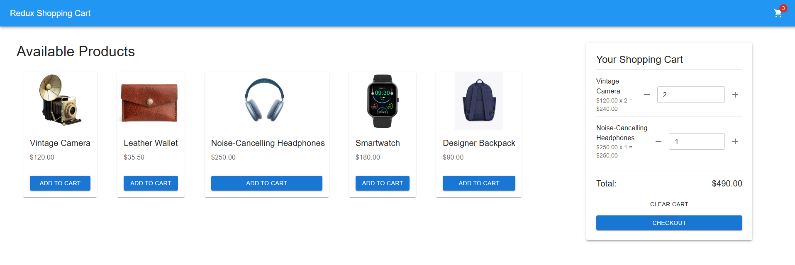

# Re-Cart

An interactive shopping with state tracking using Redux Toolkit.

## Motivation:  
To perform CRUD operations on items in a cart, and derive computed state (totalPrice) from a base state.

## Details:
Using one selector to derive updated card quantity whenever the shopping cart state is re-rendered, and 5 actions under a single reducer (`removeFromCart`, `decrementQuantity`, `incrementQuantity`, `clearCart`, `setItemQuantity`) the state of a single shopping card is updated whenever an item is added or removed. The total price of the cart is re-calculated with each dispatched action. And the quantity of items in the cart is re-calculated and located on the shopping cart icon in the header. 

## Quick start:
1. Clone branch  
2. If not already installed:  
`npm install @reduxjs/toolkit react-redux redux`  
Search [chrome.google.com/webstore](chrome.google.com/webstore) to add Redux Devtools  
3. `npm install`  
`npm run dev`
